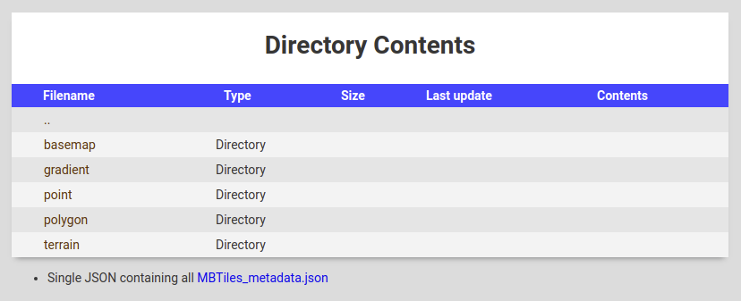

# tiny-tileserver

[](https://travis-ci.org/Artsdatabanken/tiny-tileserver)
[](https://coveralls.io/github/Artsdatabanken/tiny-tileserver?branch=master)
[](https://greenkeeper.io/)
[](https://github.com/ellerbrock/open-source-badges/)
[](https://opensource.org/licenses/mit-license.php)
[](CONTRIBUTING.md#pull-requests)
[](https://github.com/prettier/prettier)

[](https://maps.artsdatabanken.no)

Demo: [tiny-tileserver](https://maps.artsdatabanken.no)

tiny-tileserver is a minimal raster and vector tile server. It only supports .mbtiles containing rasters of .png, .jpg and vector tiles in .pbf protobuf format. Vector tiles needs to be stored gzip compressed in the .mbtiles file.

## Features

- Supports thousands of tile sets
- Vector tiles (MBTiles)
  - Serve protobuf .pbf vector tiles
  - Compressed (deflate, gzip) or uncompressed tiles
  - Can convert to .geosjon
  - Return semi-raw protobuf as json (integer coordinates)
- Raster tiles (MBTiles)
  - Serve png or jpg raster tiles
- Static files
  - Can serve any other file statically

## Installation

Put one or more .mbtiles inside the data subfolder.

Execute:

yarn
yarn start

Navigate to http://localhost:8000/ to display a summary of the tile sets.

Tiles can be pulled using an url of this form: http://localhost:8000/{name}/{zoom}/{x}/{y}

## Configuration

Tiny-tileserver has command-line options:

```
Usage: node tiny-tileserver.js [options] [rootDirectory]

rootDirectory    Data directory containing .mbtiles

Options:
   -p PORT --port PORT       Set the HTTP port [8000]

A root directory is required.
```

## Images

The following images are built for each tiny-tileserver release, using the Node.js base image.

- Latest: https://hub.docker.com/r/artsdatabanken/tiny-tileserver/

### Docker image ##

To use prebuilt docker image, navigate to a folder containing .mbtile file(s) and run

```
docker run -v ${pwd}:/data -p 8000:8000 artsdatabanken/tiny-tileserver
```
